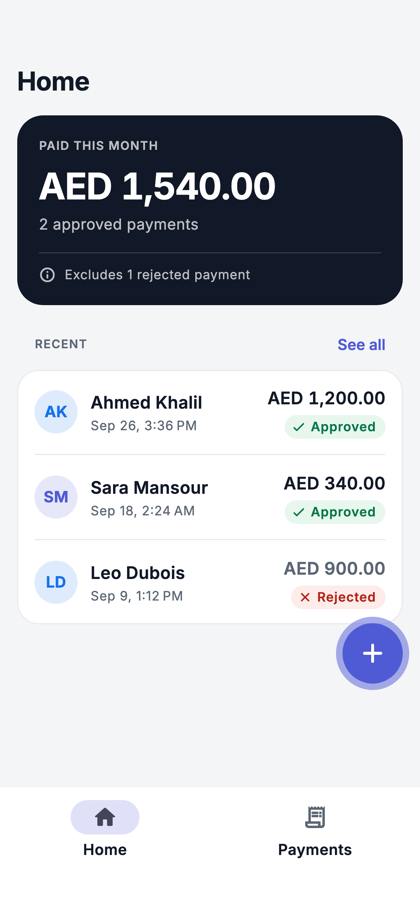
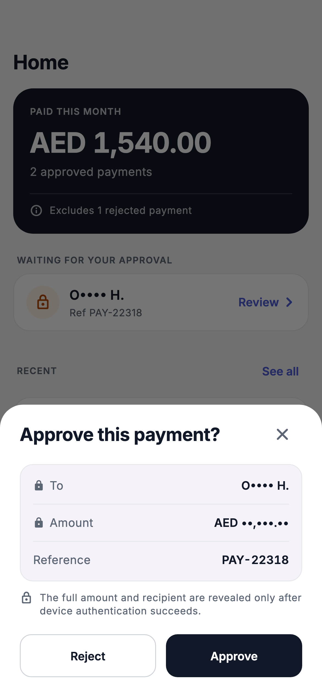
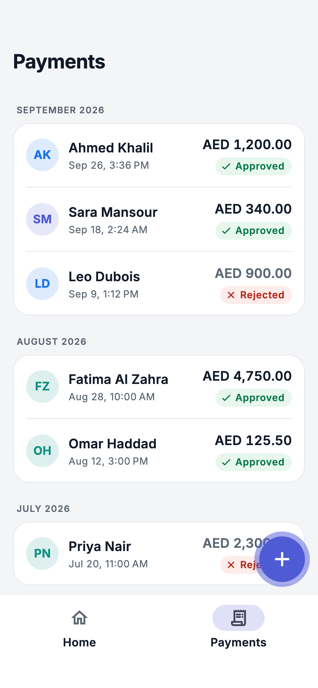
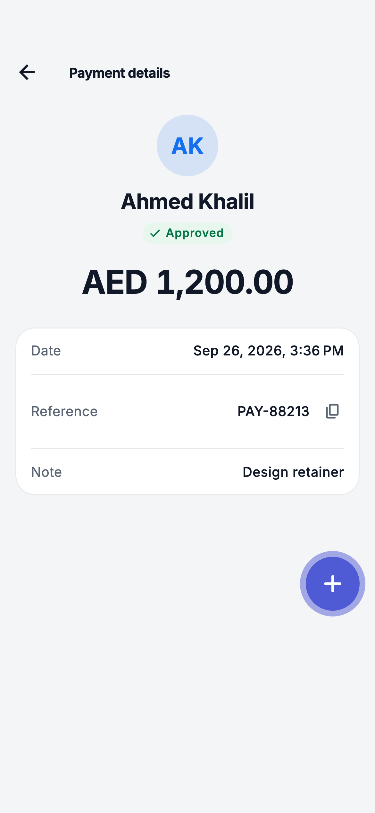
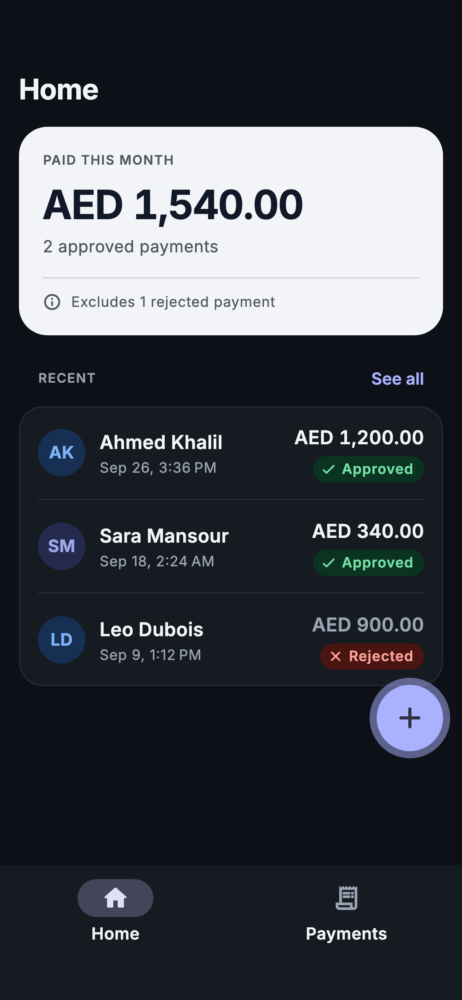
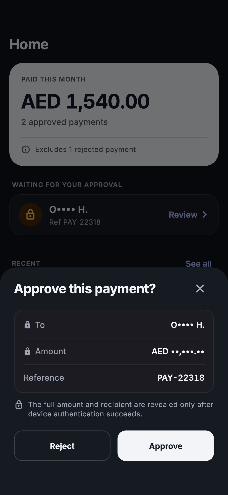
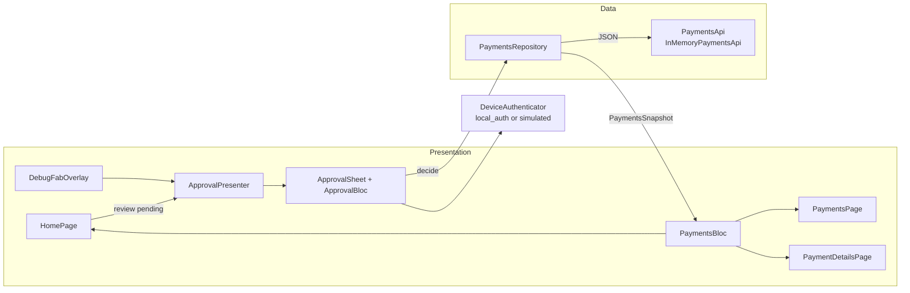

# Payment approval flow

A small Flutter feature built the way I would ship it inside a production banking app: an incoming payment request appears over whatever you are doing, you approve or reject it with device authentication, and the result shows up everywhere at once.

[](https://github.com/SardorbekR/payment-approval-flow/actions/workflows/ci.yml)

## Try it

| | |
|---|---|
| **Web** | **[sardorbekr.github.io/payment-approval-flow](https://sardorbekr.github.io/payment-approval-flow/)**. Opens instantly on a laptop or a phone. |
| **Android** | [Download the APK](https://github.com/SardorbekR/payment-approval-flow/releases/latest) (`arm64` fits most phones). It uses the real fingerprint, face or PIN prompt. |
| **iOS** | Build from source, see [Running locally](#running-locally). |

1. Tap the **+** button to receive a payment request. You can drag it anywhere, and it stays where you leave it.
2. **Approve** or **Reject** it. Both ask you to confirm it's you. Browsers can't reach Face ID or fingerprint sensors, so the web build shows a clearly labelled simulated prompt that can also be cancelled or failed.
3. Approving takes you to Payments with the new payment on top. Rejecting keeps you where you were.
4. Close the sheet without deciding, and the request waits on Home until you come back to it.

<p>
  
  
  
  
</p>
<p>
  
  
</p>

## Acceptance criteria

| Criterion | Where it happens |
|---|---|
| Home summarises this month | `MonthlySummary.of` sums approved payments within the local calendar month. |
| Rejected payments don't count | Only approved payments are summed. The card says how many rejected ones were left out. |
| Recent payments on Home | The latest three, with a way to see all. |
| Payments list, most recent first | Sorted by decision time, then by id, so a request decided late still lands on top. Grouped by month. |
| Each row: who, amount, status | Name, amount, a status badge with icon and label, and a relative date. |
| A new decision appears on top right away | One snapshot update moves the request into the list. The list scrolls to it and highlights it, even when it was decided from another tab. |
| Details only for decided payments | A pending request is a different type with no details to show, and a pending or unknown id (typed on the web) shows "Payment unavailable". |
| Back returns to where details were opened | Details sit above the tabs, so back returns to the tab that opened them. A details link opened directly falls back to Home. |
| Debug button on every screen | It lives above the router, so it floats over every screen, including details. |
| Drag anywhere, stays for the session | Position is kept in the overlay's state for the life of the app, clamped to the screen and clear of the notch and home indicator. |
| Tap for a new request | The in-memory server creates one and the sheet opens. |
| Request appears over the current screen | A modal bottom sheet, not a new route. |
| Amount and name partly hidden, reference in full | See [How the data is protected](#how-the-data-is-protected). |
| Approve takes me to Payments | After the sheet closes, the app navigates to Payments. If details were open, they close. |
| Reject takes me back | Nothing navigates. A snackbar confirms it and offers to view the payment. |
| Updated state everywhere | Home, Payments and details read one shared snapshot. |

## Beyond the brief

- **The device never holds the amount or the full name before you authenticate.** A pending request carries only a masked name, the currency and the reference. The full payment comes back from the decision call, which runs only after device authentication succeeds.
- **Masks that leak nothing.** The amount mask is always `AED ••,•••.••`, so it doesn't hint at the size of the payment. The name mask always uses four bullets, so it doesn't reveal the name's length.
- **Both decisions need device authentication.** A rejected payment shows its full name and amount afterwards, so an unauthenticated reject would reveal them. It also stops someone holding your phone from rejecting your payments.
- **Fails closed.** A failed match, a lockout, or a device with no screen lock blocks the decision with an explanation. A cancelled prompt changes nothing.
- **No half-finished decisions.** While authentication or submission is running, the sheet can't be closed: back and tap-outside are blocked, and dragging is off because in Flutter a drag closes a bottom sheet without asking `PopScope`. Extra taps are dropped with `droppable()`, and a retry authenticates again.
- **Closing isn't rejecting.** A request you close stays pending and is listed on Home until you decide.
- **A request decided elsewhere** is reported as no longer available and removed.
- **Money is exact.** Amounts are integer minor units (fils) end to end, parsed strictly and formatted with integer math.
- **Time is handled carefully.** Times are stored as UTC instants and shown in local time. "This month" follows your local calendar, and the tests pass in any time zone.
- **Fresh demo data every visit.** The seed history mirrors the wireframe and always lands in the current month, even minutes after midnight on the 1st.
- **The debug button behaves.** It follows the finger exactly, moves back on screen when the window shrinks, and hides while a sheet is open.
- **Accessible and adaptable.** Light and dark themes. Layouts hold at 200% text size and in landscape. Screen readers hear "Amount hidden until you authenticate" instead of a row of bullets. Status never relies on color alone, and layouts are directional, ready for right-to-left.
- **A web demo that respects your time.** On a wide window the app sits in a phone frame next to a three-step guide.

## How the data is protected

```
Server (in memory)                         Device
recipient_name, amount, note     ──►       PaymentRequest { id, reference, recipient_masked: "A•••• K.", currency }
                                           │  Approve or Reject
                                           │  device authentication succeeds
submitDecision(id, decision)     ◄──       │
full payment JSON                ──►       Payment { recipient_name, amount, status, decided_at, note }
```

`InMemoryPaymentsApi` stands in for the backend and plays by the same rules a real one would. In production I would also bind the decision to a hardware-backed key (Android Keystore or the Secure Enclave) and have the server verify the signature, so the server doesn't have to trust the client's word that authentication happened.

## Architecture



- **Domain** (`features/payments/domain`) is plain Dart: `Money`, `Payment`, `PaymentRequest`, `PaymentsSnapshot` and `MonthlySummary`. No Flutter, no I/O.
- **Data** (`features/payments/data`):
  - `PaymentsApi` is the backend contract, expressed as JSON.
  - `payment_json.dart` parses strictly and names the field when something is wrong.
  - `PaymentsRepository` is the single source of truth. It publishes whole snapshots, and new listeners get the latest one.
- **Presentation**:
  - One `PaymentsBloc` above the router feeds every screen.
  - `ApprovalPresenter` owns the approval sheet, so only one is ever open, and decides where to go after a decision.
  - `ApprovalBloc` runs authentication and then the decision.
- **Routing** (`router.dart`) uses go_router's `StatefulShellRoute` for the two tabs. Details is a top-level route above them.

```
lib/
  app.dart, main.dart, router.dart
  core/          device_auth, formatting, theme
  features/
    approval/    presenter, bloc, sheet
    debug_fab/   overlay and position rules
    home/        page, summary card, pending requests
    payments/    domain, data, bloc, pages, widgets
    shared/      shell, demo frame, shared widgets
  l10n/          English strings (ARB)
```

## Decisions and trade-offs

- **Latest stable Flutter (3.47.5) and packages.** Material comes from `material_ui`, Flutter's Material library now published on its own, which go_router 18 is built on.
- **Tabs are one page deep and details sits above them.** This matches the wireframe, where details has no tab bar, and keeps back navigation predictable.
- **No code generation.** freezed, json_serializable, injectable and mockito's generated mocks are all left out. The models are small, so hand-written code stays short and easy to review. mocktail and plain fakes cover the tests.
- **Classic constructors.** Dart 3.13's new primary constructors are only weeks old. I kept the classic syntax and turned off the lint rules that push the new one, with a note in `analysis_options.yaml`.
- **An in-memory server rather than mocks in the UI.** Latency, masking and error cases live in one place and behave like a backend would.
- **One English locale, ready for more.** All strings are in ARB files and layouts are directional, so Arabic is a translation away.

## Testing

172 tests: unit, bloc (`bloc_test`), widget, end-to-end flows through the whole app, and golden screenshots.

```sh
flutter test                         # everything (goldens are recorded on macOS)
flutter test --exclude-tags golden   # what CI runs on Linux
```

`test/app_flow_test.dart` drives the real app, router, repository and in-memory server, with only device authentication faked. It covers:

- approving from Home and from details;
- rejecting in place;
- closing the sheet and coming back to the request;
- back and tap-outside being blocked while the prompt is open;
- a cancelled prompt;
- a request decided elsewhere;
- the debug button keeping its place;
- large text and landscape.

## Running locally

Requires Flutter 3.47.5 (stable).

```sh
flutter pub get
flutter run              # a connected device or simulator
flutter run -d chrome    # web
```

An Android emulator with no screen lock can't approve or reject; that is the fail-closed behaviour. Set a PIN in the emulator's settings to try it.

## Known limitations

- Everything lives in memory, so restarting the app or refreshing the page starts a fresh session.
- If the app sits open on Home across midnight at the end of a month, the summary updates on the next change rather than exactly at midnight.
- The payment history isn't paginated. It's short in this demo; a real one would page from the server.

## What I would do next

- Sign decisions with a hardware-backed key and verify them on the server.
- Expire requests after a few minutes and deliver them with push notifications.
- Cache payments for offline use.
- Add Arabic with a right-to-left review.
- Protect sensitive screens from screenshots and the app switcher.
